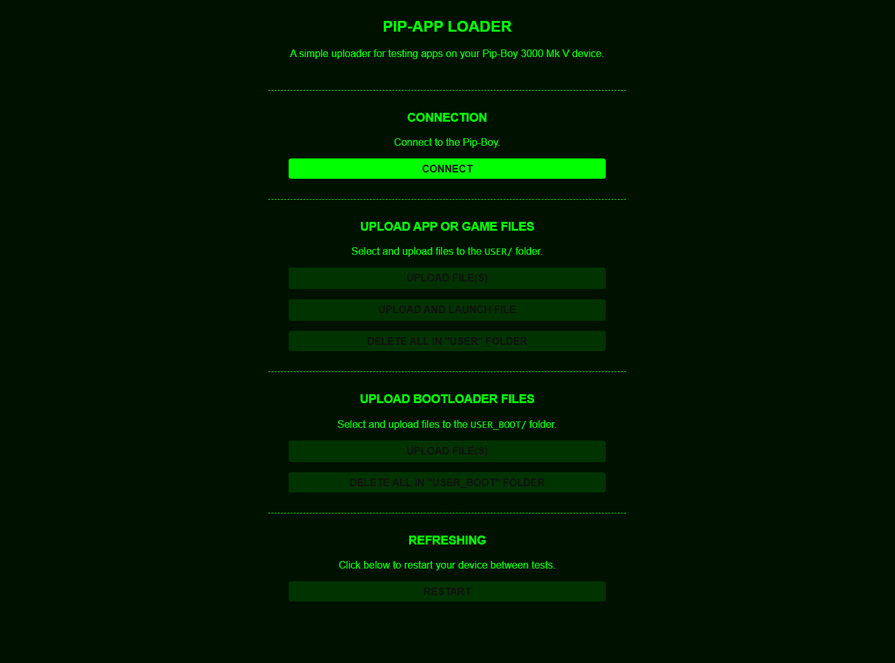

<div align="center">
  
  <h1 align="center">Pip-Apps</h1>
  <p align="center">
    A common repository to house all the great apps and games made by fellow vault-dwellers for the Pip-Boy 3000 Mk V device. Apps are hosted on <a href="https://pip-boy.com/" target="_blank">pip-boy.com</a> and are open-source for all to enjoy.
  </p>
  <p align="center">
    Purchase the device from the Bethesda store 
    <a href="https://gear.bethesda.net/products/fallout-series-pip-boy-die-cast-replica">
      here</a>. View the official upgrade site 
    <a href="https://www.thewandcompany.com/pip-boy/upgrade/">
      here</a>.
  </p>
</div>

<!---------------------------------------------------------------------------->
<!---------------------------------------------------------------------------->
<!---------------------------------------------------------------------------->

## Index <a name="index"></a>

- [Website](#website)
- [Playing the Apps/Games](#playing-the-apps-games)
  - [Website Installation](#website-installation)
  - [Manual Installation](#manual-installation)
- [Development](#development)
  - [Prerequisites](#prerequisites)
  - [Setup](#setup)
  - [Pip-App Loader](#pip-app-loader)
  - [Learning app development](#learning-app-development)
  - [Creating a New App/Game](#new-app-game)
- [Directory Structure](#directory-structure)
- [License(s)](#licenses)
- [Terms of Use](#terms)
- [Wrapping Up](#wrapping-up)

<!---------------------------------------------------------------------------->
<!---------------------------------------------------------------------------->
<!---------------------------------------------------------------------------->

## Website <a name="website"></a>

[**Pip-Boy.com**](https://pip-boy.com/)

Just here to have some fun? Head over to the
[Apps Inventory](https://pip-boy.com/inv/apps) and start playing right from your
Pip-Boy’s interface, no fuss, no power armor required. Otherwise you can install
manually using this repository, follow that guide [here](#manual-installation)
to get started.

Feeling like a Vault-Tec engineer? If you’re interested in developing your own
holotape-style apps, follow the [development guide](#development) below to get
started. Thanks for being part of the Wasteland's growing arcade!

<p align="right">[ <a href="#index">Index</a> ]</p>

<!---------------------------------------------------------------------------->
<!---------------------------------------------------------------------------->
<!---------------------------------------------------------------------------->

## Playing the Apps/Games <a name="playing-the-apps-games"></a>

### Website <a name="website-installation"></a>

You can install and play apps directly from https://pip-boy.com/. Just connect
to your PC using the website and start playing!

> ![Info][img-info] Games will be available under the INV > APPS tabs on your
> Pip-Boy device once uploaded.

<p align="right">[ <a href="#index">Index</a> ]</p>

### Manual Installation <a name="manual-installation"></a>

To manually install the apps, you have a few options:

1. Download the latest `apps.zip` archive from the
   [latest build](https://github.com/CodyTolene/pip-apps/actions/workflows/zip-apps.yml)
   and extract the contents to the root of the SD card. You can use the Zip
   upload tool here: https://pip-boy.com/data/maintenance. This is the easiest
   option and doesn't require you to remove the SD card.

2. Copy the entire USER folder from this repository over to the root of the SD
   card. This will overwrite any existing apps and settings. This requires you
   to remove the SD card though, so probably not the best option.

3. Use the [development process](#development) below, which is meant for rapidly
   testing apps and features. This requires a bit of setup but is the most
   flexible option.

<p align="right">[ <a href="#index">Index</a> ]</p>

<!---------------------------------------------------------------------------->
<!---------------------------------------------------------------------------->
<!---------------------------------------------------------------------------->

## Development <a name="development"></a>

### Prerequisites <a name="prerequisites"></a>

To get started with development, you will need the following:

- Node.js: https://nodejs.org/en/download/
- An IDE, preferably Visual Studio Code: https://code.visualstudio.com/download
- A bit of knowledge on how to use a terminal (you're a Vault-Tec engineer after
  all)

<p align="right">[ <a href="#index">Index</a> ]</p>

### Setup <a name="setup"></a>

To get set up for development, follow these steps:

1. Clone the repository.

2. Run `npm install` in a new terminal at the root of this project, to install
   the project dependencies.

3. Run `npm install -g espruino` to install the Espruino CLI globally for
   communicating with your device.

<p align="right">[ <a href="#index">Index</a> ]</p>

### Pip-App Loader <a name="pip-app-loader"></a>



Once you have the project and dependencies [set up](#setup) locally, you can
start the app loader to test your apps and games. To do this, follow these
steps:

1. Run `npm run start` to start the loader app. This is the app you will use to
   rapidly upload and test your app.

2. Open a browser and navigate to `http://localhost:3000` if it doesn't open
   automatically.

3. From here you can connect and upload your app files for quick testing.

> ![Info][img-info] Any file beginning with "boot." will upload to USER_BOOT
> instead of the USER folder. This allows rapid testing of apps meant to run at
> boot time. For more information, see [here][link-bootloader-info].

> ![Info][img-info] The loader app is also available via GitHub pages here
> https://codytolene.github.io/pip-apps

<p align="right">[ <a href="#index">Index</a> ]</p>

### Learning app development <a name="learning-app-development"></a>

Interested in learning how to develop apps for the Pip-Boy 3000 Mk V? Check out
the excellent
[RobCo Industries Documentation](https://log.robco-industries.org/documentation/pipboy-3000/)
for everything you need to get started.

Special thanks to [@rikkuness](https://github.com/rikkuness) for the hard work
in providing and maintaining this amazing resource!

<p align="right">[ <a href="#index">Index</a> ]</p>

### Creating a New App/Game <a name="new-app-game"></a>

To create a new app/game, follow these steps:

1. Create a new js file using pascal casing (ie `MyGame.js`) in the `USER`
   folder. This will be the entry point for your app.

2. Test by using the upload tool in the [app loader](#pip-app-loader).

3. Update the `registry.json` file with the new app information.

   ```diff
   [
     ...
   + {
   +      "author": "My name...",
   +      "description": "My app description...",
   +      "files": [
   +        "USER/MyAppName.js",
   +        "USER/MyAppName/my-asset.json",
   +        "USER_BOOT/MyBootCode.js"
   +      ],
   +      "homepage": "",
   +      "id": "MyAppName",
   +      "instructions": "My app instructions & controls...",
   +      "name": "My App Name",
   +      "tip": "",
   +      "type": "APP",
   +      "version": "1.0.0"
   + }
   ]
   ```

   | Key            | Description                                                 |
   | :------------- | :---------------------------------------------------------- |
   | `author`       | Your name or handle.                                        |
   | `files`        | The array of files that the app uses.                       |
   | `description`  | A brief description of your app.                            |
   | `homepage`     | A link to your website or social media, can be empty.       |
   | `id`           | A unique app id that also should match the `.js` file name. |
   | `instructions` | Instructions and controls for your app.                     |
   | `name`         | The name of your app.                                       |
   | `tip`          | A tip or trick for your app, can be empty.                  |
   | `type`         | The type of app, either "APP" or "GAME".                    |
   | `version`      | The version of your app.                                    |

4. Add your code using Git and push to a new branch.

5. Open a pull request to the `main` branch.

6. Wait for the pull request to be reviewed and merged.

Thank you for any and all contributions!

<p align="right">[ <a href="#index">Index</a> ]</p>

<!---------------------------------------------------------------------------->
<!---------------------------------------------------------------------------->
<!---------------------------------------------------------------------------->

## Directory Structure <a name="directory-structure"></a>

    .
    ├─ .github                     # GitHub configuration files.
    ├─ .husky                      # Husky configuration files.
    ├─ .vscode                     # VS Code configuration files.
    ├─ docs                        # The Pip-App Loader web app (GitHub Pages hosted)
    ├─ node_modules                # Node.js dependencies (ignored).
    ├─ USER                        # The directory for user created apps and games.
    │  ├─ <...>                    # Asset folders for user created apps.
    │  └─ *.js                     # User created apps and games (entry file).
    ├─ .gitignore                  # Git ignore configuration file.
    ├─ .prettierignore             # Prettier ignore configuration file.
    ├─ LICENSE.md                  # The project license file.
    ├─ package-lock.json           # Node.js package lock file.
    ├─ package.json                # Node.js package file.
    ├─ prettier.config.cjs         # Prettier configuration file.
    ├─ registry.json           # The app registry file for user created apps.
    ├─ README.md                   # The project README file.
    └─ TERMS.md                    # The project terms of use file.

<p align="right">[ <a href="#index">Index</a> ]</p>

<!---------------------------------------------------------------------------->
<!---------------------------------------------------------------------------->
<!---------------------------------------------------------------------------->

## License(s) <a name="licenses"></a>

This project is licensed under the Creative Commons Attribution-NonCommercial
4.0 International License. See the [license][link-license] file for more
information.

`SPDX-License-Identifiers: CC-BY-NC-4.0`

> ![Warn][img-warn] By using this software, you acknowledge and agree to the
> terms of these licenses.

<p align="right">[ <a href="#index">Index</a> ]</p>

<!---------------------------------------------------------------------------->
<!---------------------------------------------------------------------------->
<!---------------------------------------------------------------------------->

## Terms of Use <a name="terms"></a>

Bethesda Softworks, LLC. The Wand Company, all trademarks, logos, and brand
names are the property of their respective owners. This project is for personal
use only and is not intended for commercial purposes. Use of any materials is at
your own risk.

> ![Info][img-info] For more information, see the full [Terms of
> Use][link-terms] document.

<p align="right">[ <a href="#index">Index</a> ]</p>

<!---------------------------------------------------------------------------->
<!---------------------------------------------------------------------------->
<!---------------------------------------------------------------------------->

## Wrapping Up <a name="wrapping-up"></a>

Thank you to Bethesda & The Wand Company for such a fun device to tinker with!
If you have any questions, please let me know by opening an issue
[here][link-new-issue].

| Type                                                                      | Info                                                           |
| :------------------------------------------------------------------------ | :------------------------------------------------------------- |
|                 | webmaster@codytolene.com                                       |
|            | https://github.com/sponsors/CodyTolene                         |
|      | https://www.buymeacoffee.com/codytolene                        |
|  | bc1qfx3lvspkj0q077u3gnrnxqkqwyvcku2nml86wmudy7yf2u8edmqq0a5vnt |

Fin. Happy programming friend!

Cody Tolene

<!---------------------------------------------------------------------------->
<!---------------------------------------------------------------------------->
<!---------------------------------------------------------------------------->

<!-- IMAGE REFERENCES -->

[img-info]: .github/images/ng-icons/info.svg
[img-warn]: .github/images/ng-icons/warn.svg

<!-- LINK REFERENCES -->

[link-bootloader-info]: https://log.robco-industries.org/log/entry016/
[link-license]: /LICENSE.md
[link-new-issue]: https://github.com/CodyTolene/pip-apps/issues
[link-terms]: /TERMS.md
