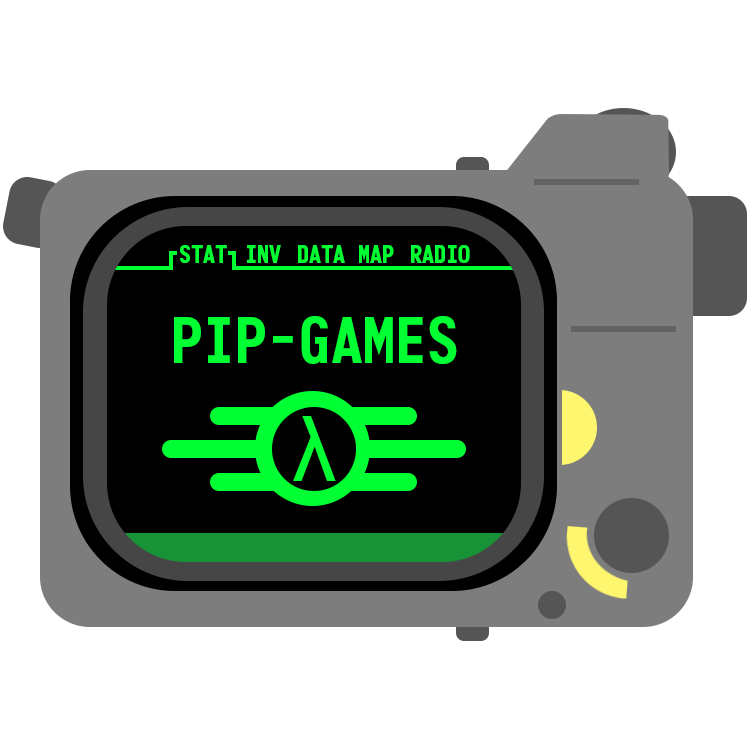

<div align="center">
  
  <h1 align="center">Pip-Boy Apps</h1>
  <p align="center">
    A forked repository of the official <a href="https://github.com/thewandcompany/pip-boy" target="_blank">Mod Tool</a> from The Wand Company to house all the great apps and games made by fellow vault-dwellers for the Pip-Boy 3000 Mk V device. Apps are hosted on <a href="https://pip-boy.com/" target="_blank">pip-boy.com</a> and are open-source for all to enjoy.
  </p>
  <p align="center">
    <a href="https://gear.bethesda.net/products/fallout-series-pip-boy-die-cast-replica" target="_blank">
      Bethesda Store
    </a>&nbsp;&#9679;&nbsp;
    <a href="https://www.thewandcompany.com/pip-boy/upgrade/">
      The Wand Company
    </a>&nbsp;&#9679;&nbsp;
    <a href="https://github.com/thewandcompany/pip-boy" target="_blank">
      Official Mod Tool
    </a>&nbsp;&#9679;&nbsp;
    <a href="https://pip-boy.com" target="_blank">
      Pip-Boy.com
    </a>
  </p>
</div>

## Pip-Boy Mod Tool

A tool to modify your pip-boy by adding apps and changing settings.

## Writing apps

If you put a JS file in the USER folder, Pip-Boy will show it in a list of apps
in the `INV` screen.

The following variables are available to you:

```js
LED_RED; //  Red element of RGB LED
LED_GREEN; //  Green element of RGB LED
LED_BLUE; //  Blue element of RGB LED
LED_TUNING; //  Radio tuning indicator LED
BTN_PLAY; //  "Play" button - *** WARNING: No JS code will run if this button is held down during boot! ***
BTN_TUNEUP; //  "Up" button
BTN_TUNEDOWN; //  "Down" button
BTN_TORCH; //  "Flashlight" button
KNOB2_A; //  Thumbwheel encoder A - PA9 for v0.3, PA10 for v0.5
KNOB2_B; //  Thumbwheel encoder B
KNOB1_BTN; //  Left knob "select" button
KNOB1_A; //  Left knob encoder A
KNOB1_B; //  Left knob encoder B
BTN_POWER; //  "Power" button

Pip.on('knob1', (dir) => {
  dir = -1 / 1 / 0;
});
Pip.on('knob2', (dir) => {
  dir = -1 / 1;
});
Pip.on('torch', () => {
  // torch button
});
```

- `g` is a graphics instance that writes direct to the screen
- `bC` is a graphics instance that writes to a 2 bit offscreen buffer, and
  calling `bC.flip()` will flip that buffer to the screen with a scanline
  effect.

You should create a function `Pip.removeSubmenu()` that removes your app from
memory (eg clears all intervals, removes all event listeners added).

## Espruino API

To get started here is a few commonly used functions from the Espruino API that
you can use in your apps:

```js
/**
 * Draw a line between x1,y1 and x2,y2 in the current foreground color.
 * @param {number} x1 - The X coordinate of the left point
 * @param {number} y1 - The Y coordinate of the top point
 * @param {number} x2 - The X coordinate of the right point
 * @param {number} y2 - The Y coordinate of the bottom point
 * @returns {Graphics} - The instance of Graphics this was called on, to allow call chaining
 * @link https://www.espruino.com/Reference#l_Graphics_drawLine
 */
drawLine(x1, y1, x2, y2);

/**
 * Draws a hollow rectangle on the screen.
 * @param {number} x1 - The left X coordinate
 *                      OR an object containing {x,y,x2,y2} or {x,y,w,h}
 * @param {number} y1 - The top Y coordinate
 * @param {number} x2 - The right X coordinate
 * @param {number} y2 - The bottom Y coordinate
 * @returns {Graphics} - The instance of Graphics this was called on, to allow call chaining
 * @link https://www.espruino.com/Reference#l_Graphics_drawRect
 */
drawRect(x1, y1, x2, y2);

/**
 * Draws a filled rectangle on the screen.
 * @param {number} x1 - The left X coordinate
 *                      OR an object containing {x,y,x2,y2} or {x,y,w,h}
 * @param {number} y1 - The top Y coordinate
 * @param {number} x2 - The right X coordinate
 * @param {number} y2 - The bottom Y coordinate
 * @returns {Graphics} - The instance of Graphics this was called on, to allow call chaining
 * @link https://www.espruino.com/Reference#l_Graphics_fillRect
 */
fillRect(x1, y1, x2, y2);

/**
 * Draws text on the screen.
 * @param {string} str - The text to draw
 * @param {number} x - The X position of the leftmost pixel
 * @param {number} y - The Y position of the topmost pixel
 * @param {boolean} solid - Whether to draw the text solid or not
 * @returns {Graphics} - The instance of Graphics this was called on, to allow call chaining
 * @link https://www.espruino.com/Reference#l_Graphics_drawString
 */
drawString(str, x, y, solid);

/**
 * Sets the current font alignment and rotation.
 * @param {number} x - X alignment. -1 = Left, 0 = Center, 1 = Right
 * @param {number} y - Y alignment. -1 = Top, 0 = Center, 1 = Bottom
 * @param {number} rotation - 0 = No rotation, 1 = 90° cw, 2 = 180°, 3 = 270° cw
 * @return {Graphics} - The instance of Graphics this was called on, to allow call chaining
 * @link https://www.espruino.com/Reference#l_Graphics_setFontAlign
 */
setFontAlign(x, y, rotation);
```

> ![info][img-info] Official Software Reference:
> https://www.espruino.com/Reference

## Build and run locally

To build and run this application locally using Docker:

```sh
git clone https://github.com/CodyTolene/pip-boy-apps.git
git submodule update --init --recursive
docker build -t pip-boy-mod-tool .
docker run -dit --name pip-boy-mod-tool -p 8080:80 pip-boy-mod-tool
```

Alternatively, for quick local development with automatic file reloading, you
can skip building the image and run it directly with:

```sh
# Unix/Linux/macOS
docker run -dit --name pip-boy-mod-tool -p 8080:80 -v "$PWD":/usr/local/apache2/htdocs/ httpd:2.4
# Windows Powershell
docker run -dit --name pip-boy-mod-tool -p 8080:80 -v ${PWD}:/usr/local/apache2/htdocs/ httpd:2.4
# Windows with CMD
docker run -dit --name pip-boy-mod-tool -p 8080:80 -v %cd%:/usr/local/apache2/htdocs/ httpd:2.4
```

Once you run the application, it will be available at `http://localhost:8080`.
You can stop the server any time with:

```sh
docker stop pip-boy-mod-tool
```

When you're finished with Docker, you can clean up with:

```sh
docker rm pip-boy-mod-tool
docker rmi pip-boy-mod-tool
docker image prune -a
docker volume prune
```

<!-- IMAGE REFERENCES -->

[img-info]: .github/images/ng-icons/info.svg
[img-warn]: .github/images/ng-icons/warn.svg
